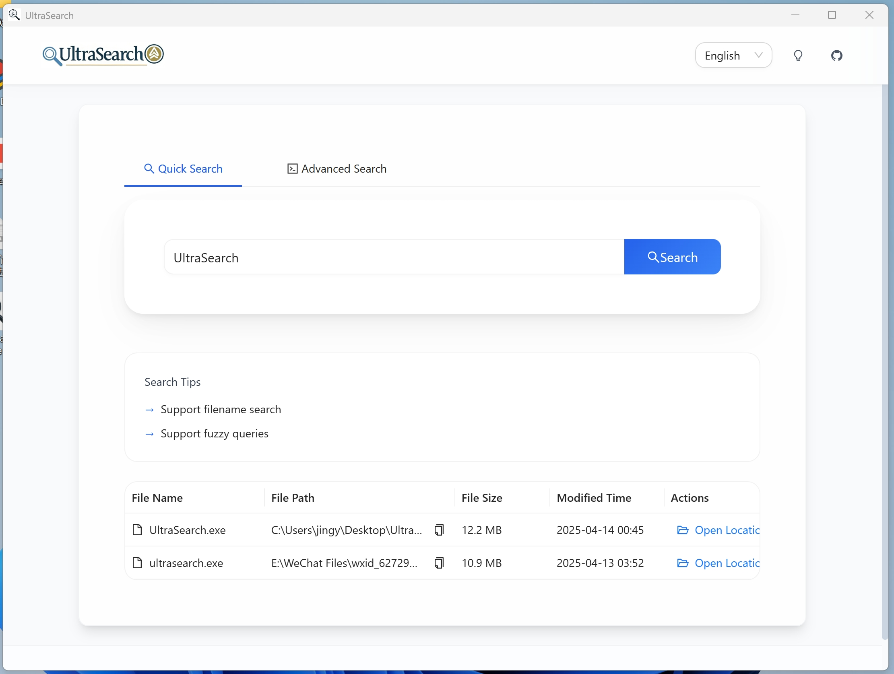
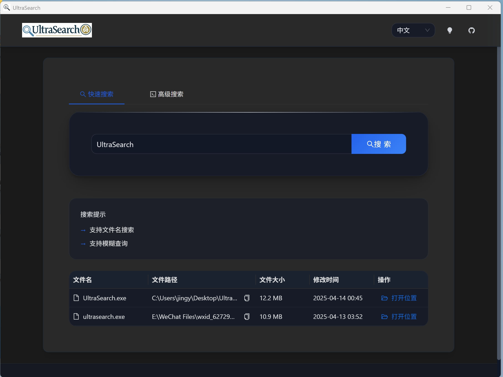

## UltraSearch
## Introduction
A cross platform PC file search tool similar to Everything, with high performance, beautiful interface, user-friendly interaction, low memory consumption, and small installation package.
一个类everything的跨平台PC端文件搜索工具，性能高，界面美观，交互友好，占用内存低，安装包小

